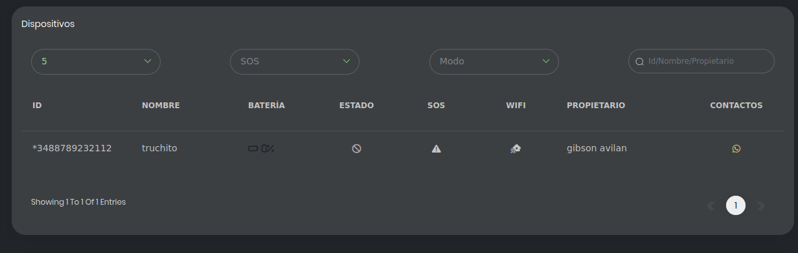

# Device Status Interface Challenge

Hi!, in this Challenge, we will provides you an objects array that contains devices status data, and you must to render his parameters in a status table component.

## Requeriments

You will need to do:

    -Create a new git branch with the first letter of your first name and your full last name like his name
     example: for the user "Carlos Ramirez" the name of the branch must be cramirez always in lower case

    -Start a new project using any JavaScript frontend framework, but we recommend the latest versions of React/Next or Vue/Nuxt frameworks.

    -Build a component that shows the status of each device, it mean, battery level, connection status, etc. using the data array (it is in the directory ./assets/devicesData.js file contained in this repository)

    -The table component, must shows max 5 devices per page

    -It is mandatory to use eslint/prettier to format the code.

    -It is forbbiden to use Material UI, Element UI or any library that provides you pre-build components apart from those mentioned in the hints section below

    -Push to github regulary code changes, avoid to make a single or few confirmations, the commits must be a sample of your work

    -Once you complete the challenge, please call the last commit like "final commit"

    -You have 36 hours to make this challenge from you receives access to this repository, don't worry if you don't complete, the final result isn't the unique criterion to evalute you, we want to see your  performance in other aspects related with software development

## Hints

We suggest you to use:

    -Tailwind CSS for app styles.

    -React Icons that describe the column title

## Extra points

You will gain extra points if:

    -Dockerize the app, using docker-compose

    -Create Responsive desing.

    -Use Typescript instead of Javascript

    -Good coding practices such as consistent and clear variable names, modularization, and adherence to the Single Responsibility Principle (SOLID).

## Final Result Example

